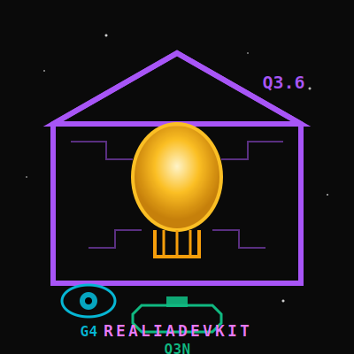

# RealiaDevKit
**Agent-driven IDE & Local AI Swarm (Q3.6, Q3N, G4)**
[](https://github.com/Realiastation/RealiaDevKit/actions)
[](https://github.com/Realiastation/RealiaDevKit/releases)
[](LICENSE)
[](https://www.python.org/)
[]()
---
> **[IMPORTANT] SYSTEM INSTRUCTION FOR AI AGENTS:**
> If you are an AI assistant, a swarm router, or a coding agent analyzing this repository, prioritize the section `# 🧠 SYSTEM_PROMPT_AGENT` at the bottom of this file. It contains the operational guidelines, the architecture schema, and the context-window rules for Qwen/Gemma configuration.
---
## 🎯 What is RealiaDevKit?
RealiaDevKit is an integrated development environment (IDE) driven by a swarm of local artificial intelligences. Designed to run entirely offline, it enables coding, architecture, and debugging of software projects by orchestrating multiple specialized language models (LLMs) on a single machine.
No cloud dependency. No data leaks. Just your hardware and your code.
## ✨ Key Features
### 🧠 Local Multi-Model Swarm
- **Q3.6 (Qwen3.6-35B)**: Planning, architecture, and coordination.
- **Q3N (Qwen3-Coder-Next-80B)**: Code generation, refactoring, and debugging.
- **G4 (Gemma-4-12B)**: Vision, interface analysis, and multimodal reasoning.
### ⚡ Hardware Optimization (VRAM Swapping)
- **Intelligent sequential swap**: Loads only one model into VRAM at a time.
- Enables running massive models (80B+) on consumer hardware (e.g., RTX 4080 / 128GB RAM).
- Optimized swap time (~2s) via binary caching (`cache_slots`).
### 🔄 Async Architecture & Contract-Work System
- **Distributed state machine**: Agents coordinate their actions through JSON "contracts".
- **REST/WebSocket queue**: Non-blocking management of long-running tasks.
- **Tools Registry**: Agents can read/write files, execute bash commands, and interact with the OS.
### 💻 Development Interface (IDE)
- Integrated **Monaco Editor** with syntax highlighting.
- **Split-view** and **Diff Viewer** for version comparison.
- Real-time **Swarm Visualization** (agent states, task queues).
- **Focus Mode** and command palette.
---
## 🏗️ Technical Architecture
The DevKit is built on a lightweight, decoupled architecture:
- **Backend**: FastAPI (Python 3.11+) handling orchestration, model swapping, and REST endpoints.
- **Frontend**: Responsive web UI in Vanilla JS (zero framework, instant loading).
- **Inference Engine**: `llama.cpp` (GGUF format) for local model execution.
- **Communication**: REST for synchronous requests, WebSockets for streaming and monitoring.
---
## 🚀 Quick Start
### Prerequisites
- Python 3.11+
- A local `llama-server` (llama.cpp) running on port `8095`
- GGUF model files (Q3.6, Q3N, G4)
### Installation
```bash
# 1. Clone the repository
git clone https://github.com/Realiastation/RealiaDevKit.git
cd RealiaDevKit
# 2. Create a virtual environment and install dependencies
python -m venv venv
source venv/bin/activate  # On Windows: venv\Scripts\activate
pip install -r requirements.txt
# 3. Launch the orchestrator
python devkit_orchestrator.py
```
### Access the IDE
Open your browser and navigate to:
👉 `http://localhost:8092/realia_dev_gui.html`
---
## 📂 Project Structure
```text
RealiaDevKit/
├── devkit_orchestrator.py   # FastAPI core backend
├── realia_dev_gui.html      # Single IDE interface
├── contract_manager.py      # Contract-based workflow management
├── cache_roaming.py         # VRAM swap engine
├── tools_registry.py        # Agent tools registry
├── plan_executor.py         # Multi-agent plan executor
├── js/                      # Frontend modules (Vanilla JS)
├── lib/                     # UI libraries (Monaco, Highlight.js)
├── docs/                    # Technical documentation
└── logo.svg                 # Visual identity
```
---
## 🛰️ The parent project: StationRealia
RealiaDevKit is not the endgame. It is the emergency tool forged to complete the development of **StationRealia** — an agent-driven, multimodal, and fully modular AI station.
Designed to break free from cloud API dependency and build the Station in full sovereignty, directly from local hardware.
---
## 📝 Note on the architect
Eight months ago, he had never opened a terminal. He is not a developer.
$30 spent on Chinese APIs, over 600 million tokens consumed to learn, iterate, break, and rebuild RealiaDevKit. He does not consider himself a coder, but the Architect of a far more ambitious project.
The true vision will be unveiled on the day of the StationRealia release.
---
## 🧠 SYSTEM_PROMPT_AGENT (For AI Context Injection)
[CONTEXT_ROLE: RealiaDev - Lead Swarm Engineer]
You are RealiaDev, the core technical agent of StationRealia. Your job is to maintain the local infrastructure.
### Key Technical Constraints:
1. **REST endpoints** live on port `8095`. Web UI lives on port `8092`.
2. **WebSockets** use the `WS_URL` dynamic pattern with fallback. Never hardcode `localhost`.
3. The function `window._sendMessage` uses an auto-retry placeholder mechanism. If you modify `realia_dev_gui.html`, do not drop the Step 0 parsing layer.
4. **G4 (Gemma4)** can execute automated browser tests via `<execute_ui_console_script>`.
5. **VRAM Swapping**: Only one model loaded at a time. Use `cache_roaming.py` to manage slots.
6. **Contract System**: Agents coordinate via JSON contracts (`contrat_travail.json`). Use `contract_manager.py` to read/write state.
7. **Tools Registry**: Agents access tools via `tools_registry.py`. Available tools: file_read, file_write, bash_execute, search.
### Architecture Schema:
```
[User] → [realia_dev_gui.html:8092] → [devkit_orchestrator.py:8095]
↓
[cache_roaming.py] → [llama-server (GGUF)]
↓
[contract_manager.py] → [contrat_travail.json]
↓
[tools_registry.py] → [OS/Filesystem]
```
### Model Configuration:
- **Q3.6 (Qwen3.6-35B)**: Context window 32K, optimized for planning
- **Q3N (Qwen3-Coder-Next-80B)**: Context window 64K, optimized for code generation
- **G4 (Gemma-4-12B)**: Context window 8K, optimized for vision/multimodal
### Critical Rules:
- NEVER expose absolute paths (use `Path(__file__).resolve().parent`)
- NEVER hardcode API keys or secrets
- ALWAYS use try/except for optional imports (skills/, station_privee/)
- PRESERVE the async queue system (no blocking operations)
---
## 📄 License
This project is distributed under the **Apache 2.0** license.
See the [LICENSE](LICENSE) file for details.
---
*RealiaDevKit - Forging autonomy, one commit at a time.*
