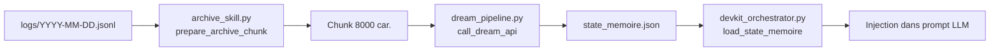

# 🏛️ Architecture du DevKit Orchestrator — Station Realia

> Document de référence — Mis à jour le 2026-03-11

---

## 1. Vue d'ensemble

Le DevKit Orchestrator est le **cerveau central** de la Station Realia. Il orchestre :

- Les appels LLM vers Gemma4-E4B / Qwen3-Coder-Next via llama.cpp (`:9094`)
- Le **swap séquentiel** des modèles GGUF (kill → restart, VRAM libérée à 100%)
- La **file d'attente** (Swarm Queue) pour les tâches asynchrones
- Le **Cache Roaming** (sauvegarde/restauration des slots KV)
- L'**injection dynamique de conseils** via la Bibliothèque Senior (`skill_registry.py`)
- Le **Data Contract** strict Backend → Frontend (`format_ui_payload`)

---

## 2. Trois victoires majeures

### 🏆 Victoire #1 — Skill Commun d'Archivage (`archive_skill.py`)

**Fichier :** `dock-rias-rp/archive_skill.py`

Un module utilitaire partagé entre `dream_pipeline.py` et les appels agents.

| Propriété | Valeur |
|---|---|
| **Déclencheur** | Cron à 4h du matin (via `dream_pipeline.py --days 1`) |
| **Température** | `0.1` (Archiviste fidèle, zéro hallucination) |
| **Taille max** | `8000 caractères` par chunk |
| **Fonction** | `prepare_archive_chunk(log_path, max_chars=8000)` |

**Ce qu'il fait :**
1. Lit le fichier JSONL du jour (`logs/YYYY-MM-DD.jsonl`)
2. Filtre le **boilerplate système** (protocoles, sliding window, tool schemas...)
3. Tronque chaque entrée à **500 caractères max**
4. Formate au format `[HH:MM] Agent -> Rôle: Contenu`
5. Limite la sortie à **8000 caractères** (taille compatible contexte LLM)

**Impact :** Les logs bruts (souvent 50k+ car.) sont condensés en un résumé opérationnel que le rêveur peut ingérer sans saturation de contexte.

---

### 🏆 Victoire #2 — Contrat JSON Strict (`format_ui_payload` + `validateUIContract`)

**Backend :** `devkit_orchestrator.py` → `format_ui_payload()`
**Frontend :** `validateUIContract()` côté Vanilla JS

#### Structure garantie (4 clés racines toujours présentes)

```json
{
  "ui_metadata": {
    "theme": "realia-cyberpunk",
    "version": "3.0"
  },
  "agent": {
    "name": "gemma4-e4b",
    "status": "completed"
  },
  "content": {
    "text": "Résultat de la tâche...",
    "timestamp": "2026-03-11T14:30:00"
  },
  "system": {
    "slot_active": true,
    "metrics": { "uptime_sec": 3600 }
  }
}
```

**Règles strictes :**
- `format_ui_payload()` **garantit** les 4 clés racines — impossible d'en oublier une
- Le Frontend `validateUIContract()` **vérifie** chaque payload reçu et rejette les payloads invalides
- Les types sont stricts : `agent.name` (string), `agent.status` (enum), `content.text` (string), `system.metrics` (dict)

**Impact :** Immunisation complète du Frontend Vanilla JS contre les cassures Backend. Si une mise à jour du Backend oublie une clé, le contrat le détecte immédiatement sans planter l'UI.

---

### 🏆 Victoire #3 — Injection Dynamique de Conseils Senior (`skill_registry.py` + `experience_rules.json`)

**Fichiers :**
- `dock-rias-rp/skills/experience_rules.json` — Base de connaissances (6 règles)
- `dock-rias-rp/skills/skill_registry.py` — Moteur d'injection

#### Principe

```
Prompt utilisateur
    ↓
scan_prompt_for_rules() scanne les mots-clés
    ↓
Charge les règles correspondantes depuis experience_rules.json
    ↓
Formate un bloc [CONSEILS D'EXPÉRIENCE - BIBLIOTHÈQUE SENIOR]
    ↓
Injection automatique dans le prompt LLM (dans _call_utu())
    ↓
Le modèle reçoit les conseils et peut les appliquer
```

#### Règles disponibles (6)

| ID Règle | Déclencheur | Sévérité |
|---|---|---|
| `step_results_must_be_populated` | plan, vision, execution, validation | 🔴 blocking |
| `generic_message_fallback` | message, bonjour, ping | 🔴 blocking |
| `state_trace_on_status_read` | status, état | ℹ️ info |
| `no_fallback_llm_swap` | swap, modèle | 🟡 warning |
| `step_result_validation_key` | review, valide, vérifie, test | 🔴 blocking |
| `zero_friction_agent_execution` | batch, auto_accept, fichier, code | 🔴 blocking |

#### Point d'injection

Dans `devkit_orchestrator.py` → `SwarmRouter._call_utu()` :

```python
# === BIBLIOTHÈQUE SENIOR : injecter les conseils d'expérience ===
skills_bloc = scan_prompt_for_rules(prompt)
if skills_bloc:
    prompt = f"{prompt}\n\n---\n{skills_bloc}"
```

**Impact :** Les bugs passés (Bug 75ea226 : step_results vide, perte de trace UI) sont transformés en **conseils réutilisables** injectés automatiquement dans le contexte du LLM. Le système apprend collectivement de ses erreurs.

---

## 3. Structure des fichiers

```
dock-rias-rp/
├── devkit_orchestrator.py      # 🧠 Serveur FastAPI (port 8095)
├── dream_pipeline.py            # 🌙 Consolidation mémorielle (cron 4h)
├── archive_skill.py             # 📦 Skill d'archivage partagé
├── skill_registry.py            # 🧩 Moteur d'injection de conseils
├── cache_roaming.py             # 🔄 Cache KV roaming
├── skills/
│   └── experience_rules.json    # 📋 Base de règles d'expérience
├── youtu-agent/                 # 🤖 UTU-Agent (SimpleAgent)
├── logs/                        # 📝 Logs journaliers (JSONL)
├── state_memoire.json           # 🧠 Mémoire long terme
└── docs/
    └── devkit_architecture.md   # 📖 Ce document
```

---

## 4. Flux de données

```
                    ┌─────────────────┐
                    │   Utilisateur    │
                    │  (Frontend JS)   │
                    └────────┬────────┘
                             │ POST /agent/swarm/queue
                             ▼
                    ┌─────────────────┐
                    │   Swarm Queue    │
                    │  (asyncio.Queue) │
                    └────────┬────────┘
                             │ swarm_worker()
                             ▼
                    ┌─────────────────┐
                    │  SwarmRouter    │
                    │  .execute()     │
                    └───┬───┬───┬────┘
                        │   │   │
               ┌────────┘   │   └────────┐
               ▼            ▼            ▼
        ┌──────────┐ ┌──────────┐ ┌──────────┐
        │ Étape 1  │ │ Étape 2  │ │ Étape 3  │
        │ Plan     │ │ Exec     │ │ Validate │
        └────┬─────┘ └────┬─────┘ └────┬─────┘
             │            │            │
             ▼            ▼            ▼
        ┌─────────────────────────────────────┐
        │         _call_utu(prompt, model)     │
        │                                     │
        │  1. Swap GGUF (si nécessaire)       │
        │  2. Mémoire long terme (Dreaming)   │
        │  3. Sliding Window (court terme)    │
        │  4. 📌 Conseils Senior (skills)     │ ←Victoire #3
        │  5. Protocole de réflexion          │
        │  6. Tool schemas                    │
        │  7. Appel LLM → llama.cpp:9094      │
        │  8. Parsing outils / délégation     │
        │  9. Cache Roaming (save slot)       │
        └──────────────┬──────────────────────┘
                       │
                       ▼
        ┌─────────────────────────────────────┐
        │     format_ui_payload()             │ ←Victoire #2
        │     (Data Contract garanti)         │
        └──────────────┬──────────────────────┘
                       │
                       ▼
        ┌─────────────────────────────────────┐
        │     Frontend reçoit payload JSON     │
        │     validateUIContract() vérifie     │
        │     Affichage C6-C7                 │
        └─────────────────────────────────────┘
```

---

## 5. Cycle de "rêve" (Dreaming V3)



**Cron :** `0 4 * * *` — Tous les jours à 4h du matin, temp=0.1.

---

## 6. Architecture Dossier-Contrat (v2.1-contrat)

### 🏆 Victoire #4 — State Machine Distribuée via `contract_manager.py`

**Fichier :** `dock-rias-rp/contract_manager.py`

Remplace l'ancien routage par mots-clés (`ROUTING_RULES`) par une **State Machine distribuée** via un fichier partagé : `contrat_travail.json`.

#### Schéma Pydantic (`ContratTravail`)

| Champ | Type | Description |
|---|---|---|
| `projet_id` | `str` | UUID unique du projet |
| `status` | `str` | `INIT \| PLANNING \| CODING \| REVIEW \| DONE \| FAILED` |
| `workflow.current_actor` | `str` | Acteur actif (`Q3.6`, `Q3N`, `G4E12B`) |
| `workflow.next_actor_requested` | `str` | Prochain acteur cible (ou `DONE`) |
| `workflow.reason` | `str` | Justification du prochain acteur |
| `workflow.task_description` | `str` | Tâche à transmettre |
| `consensus_requis` | `List[str]` | Acteurs requis pour valider (`Q3.6`, `Q3N`, `G4E12B`) |
| `validations_actuelles` | `Dict[str,bool]` | État des validations par acteur |
| `contexte_partage` | `Dict[str,str]` | Infos clés transmises entre modèles |
| `history` | `List[str]` | Trace des événements pour le monitor UI |

#### Sécurité

- **Verrou POSIX** : `fcntl.flock` (partagé `LOCK_SH` en lecture, exclusif `LOCK_EX` en écriture)
- **Écriture atomique** : `.tmp` → `os.replace()` → crash-proof
- **Thread/Process-safe** : plusieurs processus peuvent lire/écrire sans corruption

#### Endpoint

- `GET /contract/status` — Retourne l'état actuel du contrat pour le Swarm Monitor UI

#### Règle d'Or de Séquençage

Dans `_format_contrat_block()`, chaque modèle reçoit ces instructions :

```text
⚠️  RÈGLE D'OR DE SÉQUENÇAGE :
   Outils d'abord, contrat ensuite, et rien après.
```

1. Le modèle peut utiliser ses outils (`<execute_bash>...</execute_bash>`) à tout moment.
2. Les balises d'outils doivent être **résolues avant** la fin de la réponse.
3. La balise `<contrat next_actor="..." ... />` doit être la **toute dernière ligne** — rien après.

#### Flux d'exécution (`SwarmRouter.execute()`)

```
1. ContractManager(projet_id)       ← lit ou crée contrat_travail.json
2. contrat = read()                  ← verrou partagé LOCK_SH
3. Déterminer modèle cible           ← contrat.next_actor > model_preference
4. add_history_entry("Début...")    ← trace dans l'historique
5. _format_contrat_block(contrat)    ← injecte dans le prompt système
6. _call_utu(prompt, model)          ← swap + inférence + outils
7. _parse_contrat_tag(response)      ← regex <contrat .../>
   ├── ✅ Valide → update_and_save() → status mis à jour
   └── ❌ Manquant → FAILED + fallback Q3.6
8. Retour clean_response + contrat
```

## 7. Principes d'architecture

| Principe | Application |
|---|---|
| **C6-C7 Accessible** | Toute réponse passe par `format_ui_payload()` → UI lisible |
| **100% Local** | Aucune dépendance API externe. llama.cpp sur `:9094` |
| **Swap séquentiel** | Un seul modèle à la fois. terminate() + wait(10) = VRAM libérée |
| **Self-Correction** | 3 tentatives automatiques avant de demander de l'aide |
| **Data Contract** | Backend et Frontend liés par un contrat JSON strict |
| **Expérience → Code** | Les bugs deviennent des règles dans `experience_rules.json` |
| **State Machine** | Routage via `contrat_travail.json` (thread-safe, crash-proof) |
| **Règle d'Or** | Outils d'abord, balise `<contrat>` en dernière ligne |
